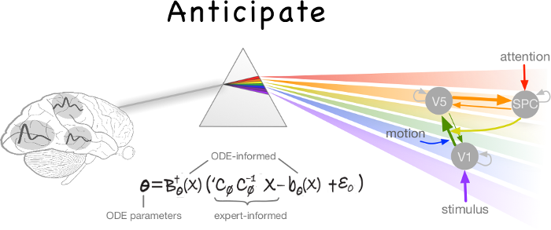

# Variational Gradient Matching for Dynamical Systems

Authors: **Nico Stephan Gorbach** and **Stefan Bauer**, email: nico.gorbach@gmail.com
</h2>

<h2 align="center"></h2>

  <a href="https://ngorbach.github.io/Variational_Gradient_Matching_for_Dynamical_Systems/#17"><b>code documentation</b></a> |
  <a href="https://papers.nips.cc/paper/7066-scalable-variational-inference-for-dynamical-systems.pdf"><b>NIPS 2017 version</b></a> |
  <a href="https://arxiv.org/abs/1705.07079"><b>arXiv version</b></a> |
  <a href="https://www.research-collection.ethz.ch/handle/20.500.11850/261734"><b>doctoral thesis</b></a> 
 

## Contents

Sample code for the NIPS (2018) paper **Scalable Variational Inference for Dynamical Systems** by Nico S. Gorbach, Stefan Bauer and Joachim M. Buhmann.
The paper is available at <https://papers.nips.cc/paper/7066-scalable-variational-inference-for-dynamical-systems.pdf>.
Please cite our paper if you use our program for a further publication. The derivations of the formulas used in this code are also given in the doctoral thesis <https://www.research-collection.ethz.ch/handle/20.500.11850/261734> as well as in parts of Wenk et al. (2018).

Run one of the Matlab scripts *VGM_for_Lotka_Volterra.m*, *VGM_for_Lorenz96.m* and *VGM_for_Lorenz_attractor.m*. Alternatively, you can also run the live scripts *VGM_for_Lotka_Volterra_live_script.mlx*, *VGM_for_Lorenz96_live_script.mlx* or *VGM_for_Lorenz_Attractor_live_script.mlx*. The code documentation is contained in the folder "docs".

The Matlab symbolic toolbox is required.

## Some Results

### Lotka-Volterra

### Lorenz 96

### Lorenz Attractor

### Dynamic Causal Modeling

